# PHP_projekt


> Целью проекта является реализация портала для скалолазов с возможностью регистрации и коллекционирования фотографий.
> celem projektu jest kolekcjonowanie zdjęć sportowców zarejestrowanych na portalu. Użytkownicy mogą dodawać swoje zdjecia na portal w jako publiczne i prywatne, a także zapisywać zdjęcia innych użytkowników.

### Портал содержит:
* Сохранение данных пользователей и загружаемые фотографии в базу данных MongoDB
* Механизм аутентификации
* Подключение к серверу Apache
* Использование JS, CSS, Ajax
* Пример использования MVC
* Галерею фотографий

### Projekt zawiera: 
* Zapisywanie wartości z formatek do bazy danych
* Mechanizm uwierzytelniania
* Wdrożenie na serwerze WWW
* Tworzenie widoków w sposób komponentowy
* Zastosowanie biblioteki JS
* Zastosowanie biblioteki CSS/Estetyka wykonania warstwy widoków
* Przesyłanie plików na serwer
* Galeria przesłanych zdjęć
* Wykorzystanie bazy danych 
* AJAX – wyszukiwarka zdjęć 
* Funkcyjna implementacja wzorca MVC


### Strona startowa
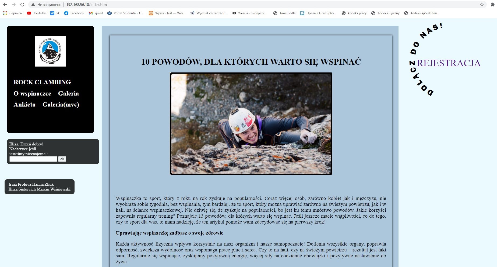
#### Tutaj znajduje się skrypt, z pomocą którego możemy przenosić obiekt (gdzie w css position: absolute).
```
$(document).ready(function () { 
    $(".muvediv").draggable({ cursor: "move" });
});
```
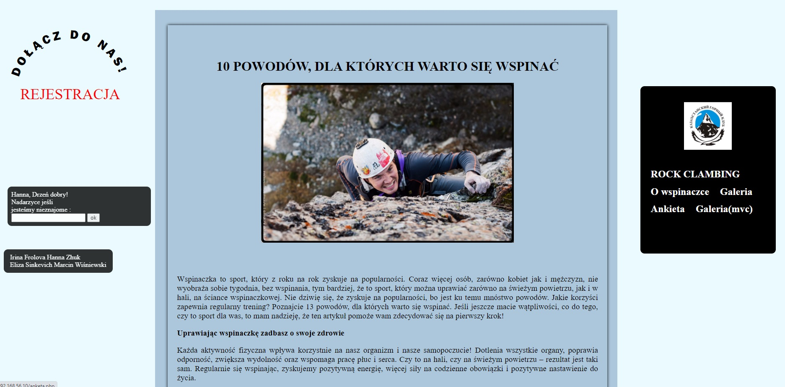


#### Poprzez kliknięcie na przycisk rejestracji (z ruchomym napisem) - idziemy do strony formularza. 

### Formularz rejestracyjny
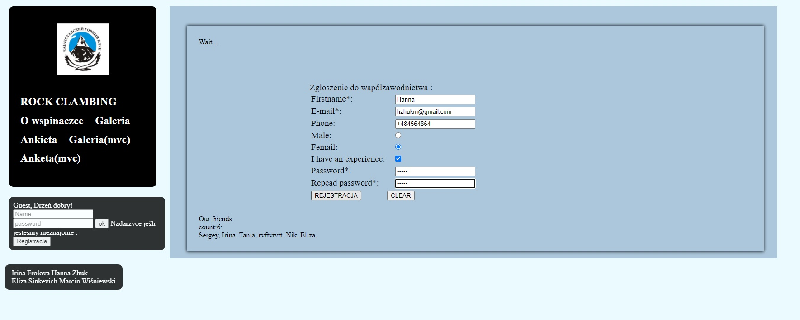

#### Na dole formularza widzimy już użytkowników zarejestrowanych w bazie danych.
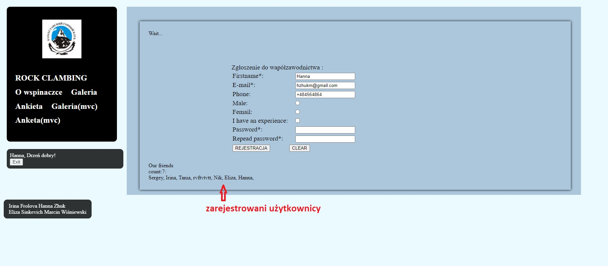
#### Po wypełnianiu wszystkich pól po lewej stronie zostanie wyświetlone imię użytkownika.
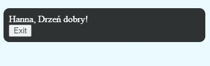

#### zapamiętanie aktualnego stanu serwisu

```
<?php	
	if ( !empty( $_SESSION['youname']) && !empty( $_SESSION['userid'])){
		if (!empty( $_GET["add"]) ){
			setcookie("youname", $_SESSION['youname'], time() + 60 * 60 * 24 * 5, "/"); //5 days
			setcookie("userid", $_SESSION['userid'] , time() + 60 * 60 * 24 * 5, "/"); //5 days	
			$_SESSION['cartp'] = [];
			setcookie("cartp", null , time() + 60 * 60 * 24 * 5, "/"); //5 days	
		}
	}else{
		$_SESSION['youname'] = 'Guest';
		$_SESSION['userid'] = '000';
		$_SESSION['cartp'] = [];	
		setcookie("cartp", null , time() + 60 * 60 * 24 * 5, "/"); //5 days		
	}	
	if (!empty( $_GET["exit"]) ){
		$_SESSION = array();
		setcookie("youname", '', time() - 60 * 60 * 24 * 5, '/');
		setcookie("userid", '', time() - 60 * 60 * 24 * 5, '/');
		$_SESSION['youname'] = 'Guest';
		$_SESSION['userid'] = '000';	
		$_SESSION['cartp'] = [];
		setcookie("cartp", null , time() + 60 * 60 * 24 * 5, "/"); //5 days
	}	

?>
```
### Logowanie
#### Użytkownik może się zalogować za pomocą tego formularza: 
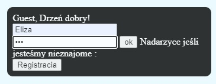

### Baza danych MongoDB
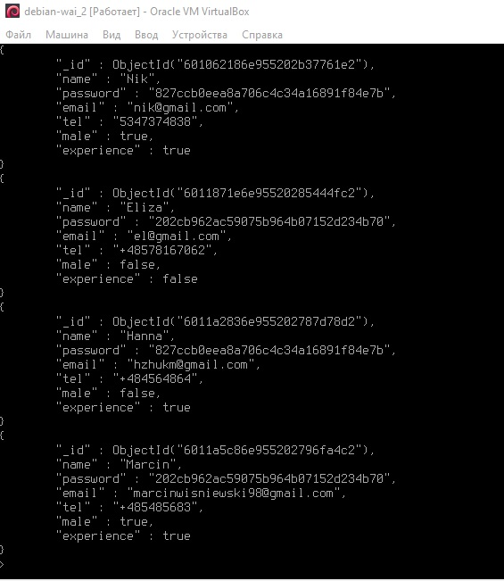
### Galeria zdjęć

#### Niezarejestrowani użytkownicy mogą oglądać galerię, ale tylko u zarejestrowanych wyświetla się funkcja dodawania.
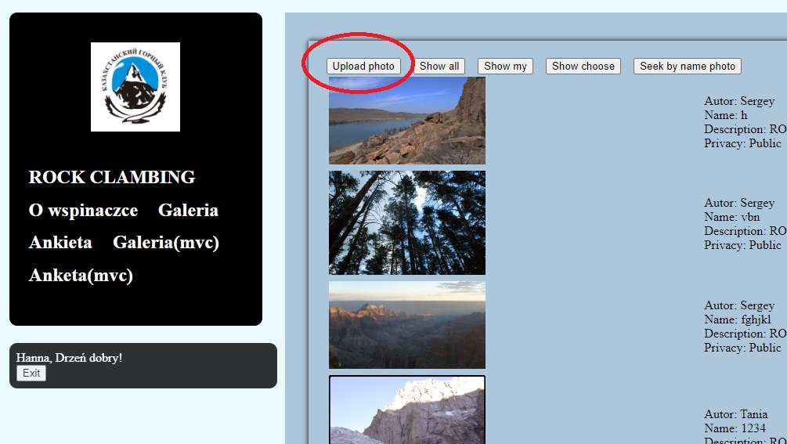
#### Pliki mogą być tylko w formacie PNG lub JPG, nie większe niż 1 MB. Jeśli użytkownik spróbuje wysłać zdjęcie o większym rozmiarze lub w innym formacie, powinien otrzymać stosowny komunikat o błędzie.

#### Zawiera znak wodny (w prawej części zdjęcia na dole).
#### Również możemy wybrać publikację prywatną lub publiczną.
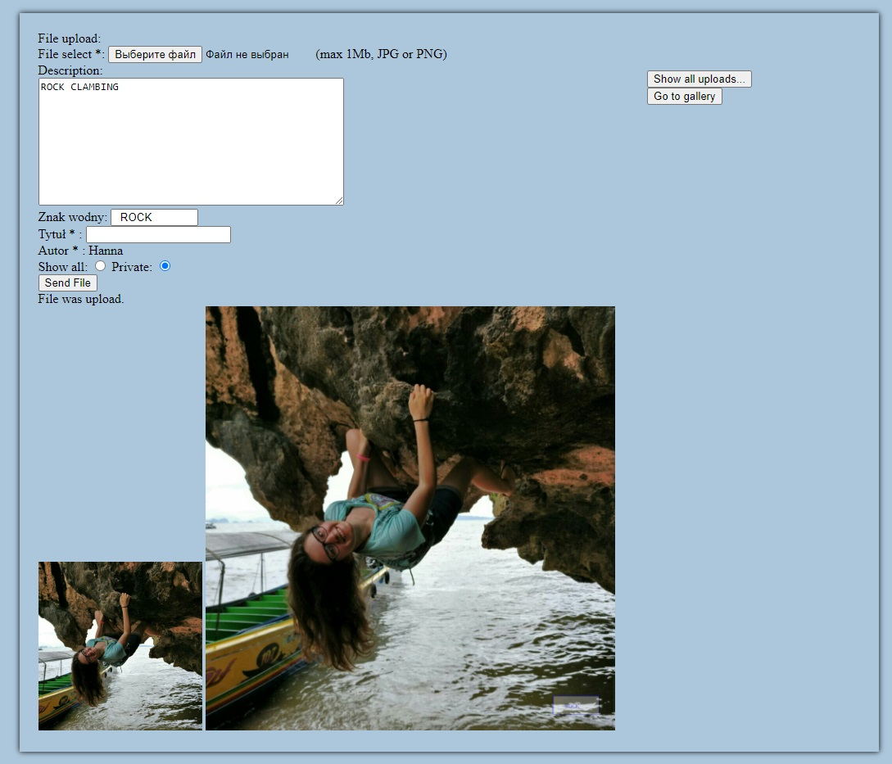
#### Użytkownik może zobaczyć dodane swoje zdjęcia w "show my".
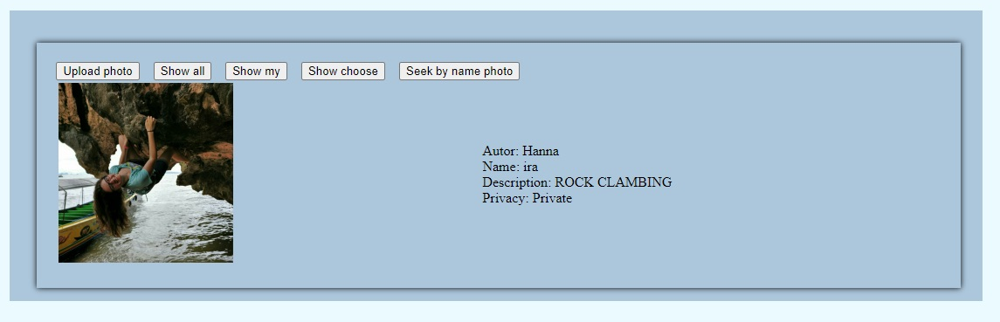
####  Po kliknięciu dowolnego zdjęcia z galerii, użytkownik może zapisać ją dla siebie.
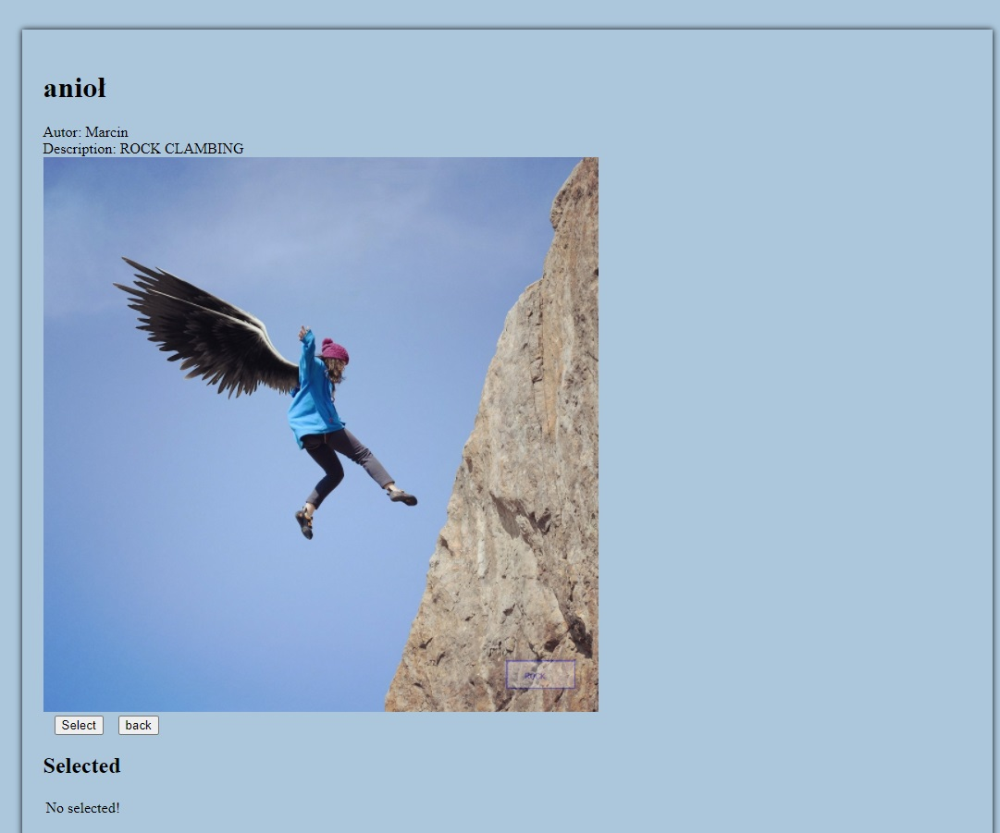

#### Zapisane zdjęcia można odnaleźć w "Show choose".
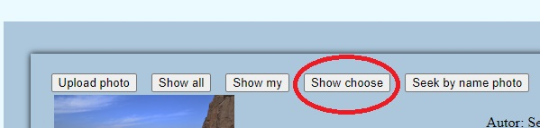
#### Istnieje również funkcja usunięcia.
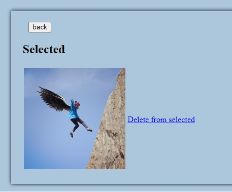

### Wyszukiwarka
#### Funkcja wyszukiwania znajduje się w "Seek by name photo".
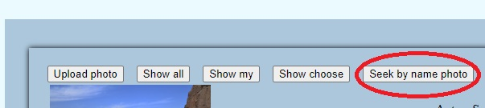
#### Z pomocą ajax znajdujemy zdjecie po nazwie.
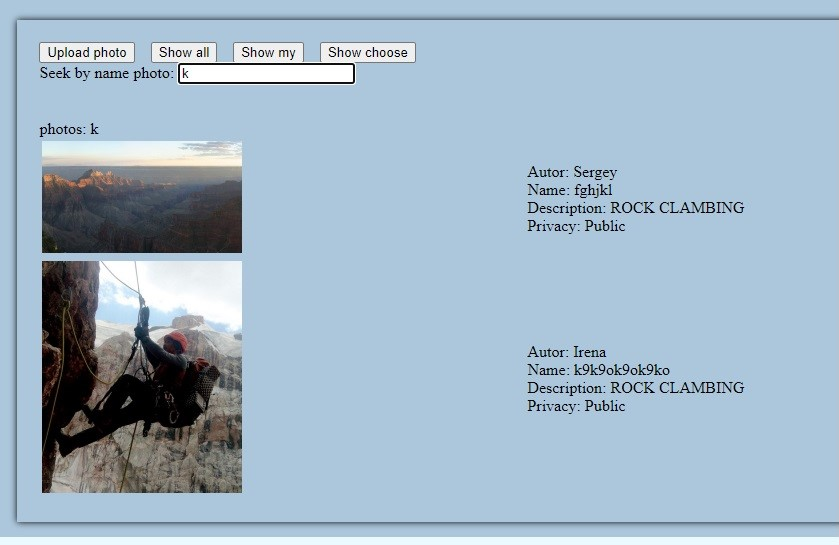


### Funkcyjna implementacja wzorca MVC
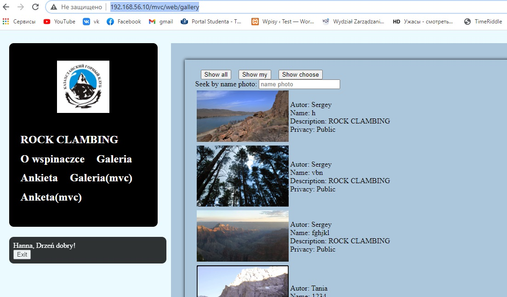
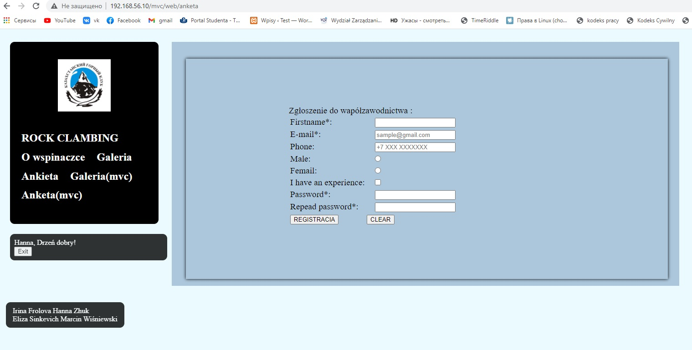

#### MVC zawierająca: 
* front-controller
* routing
* kontrolery
* model
* widoki 
* wydzieloną logikę biznesową
