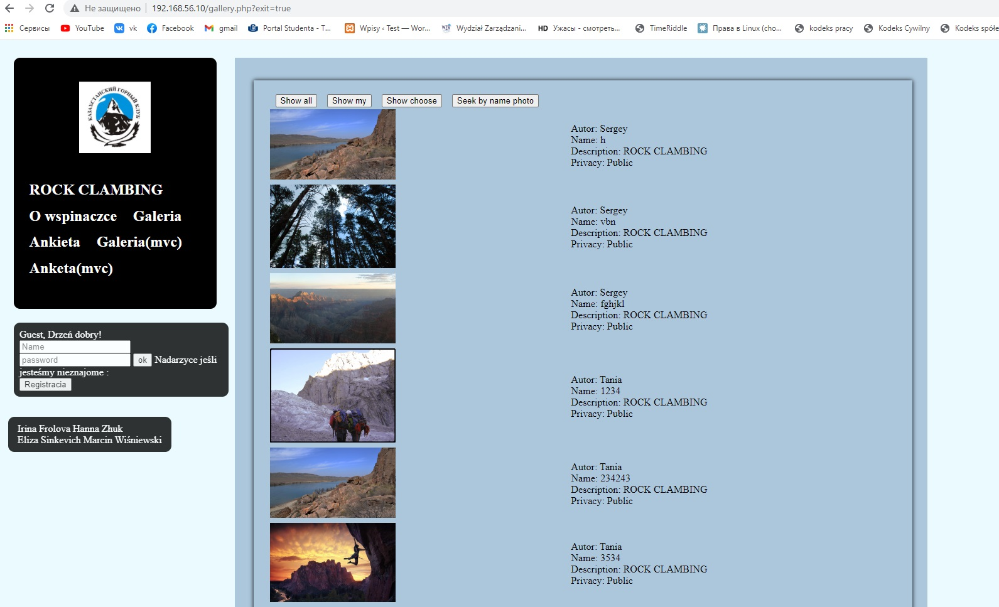

# PHP_projekt

## Projekt zaliczeniowy przedmiotu Interaktywne serwisy internetowу - Serwer dla amatorów wspinaczki
> celem projektu jest kolekcjonowanie zdjęć sportowców zarejestrowanych na portalu. Użytkownicy mogą dodawać swoi zdjecia na portal w sposób publiczny i priwatny. A także zapisywać zdjęcia innych użytkowników

### Projekt zawiera: 
* Zapisywanie wartości z formatek do bazy danych
* Mechanizm uwierzytelniania
* Wdrożenie na serwerze WWW
* Worzenie widoków w sposób komponentowy
* Zastosowanie biblioteki JS
* Zastosowanie biblioteki CSS/Estetyka wykonania warstwy widoków
* Przesyłanie plików na serwer
* Galeria przesłanych zdjęć
* Wykorzystanie bazy danych 
* AJAX – wyszukiwarka zdjęć 
* Funkcyjna implementacja wzorca MVC


### Strona startowa

#### Tutaj znajduje się  ciekawy script z pomocą którego możemy przenosić obiekt (gdzie w css position: absolute)
```
$(document).ready(function () { 
    $(".muvediv").draggable({ cursor: "move" });
});
```


#### Poprzez kliknięcie na przycisk rejestracji (z ruchomym napisem) - idziemy do strony formularza 

### Formularz rejestracyjny


#### Na dole formularza widzimy już zarejestrowanych użytkowników w bazie danych

#### Podczas wypełniania wszystkich pól po lewej stronie zostanie podświetlone napis:


### Logowanie
#### Zalogować się użytkownik może w tym formularze 


### Galeria zdjęć

#### Niezarejestrowani użytkownicy mogą oglądać galerię, ale tylko u zarejestrowanych wyświetla się funkcja dodawania

#### Pliki mogą być tylko w formacie PNG lub JPG, nie więcej niż 1 MB. Jeśli użytkownik spróbuje wysłać zdjęcie o większym rozmiarze lub w innym formacie, powinien otrzymać stosowny komunikat

#### Zawiera znak wodny (w prawej części zdjęcia na dole)
#### Również możemy wybrać publikację prywatną lub publiczną

#### Użytkownik może zobaczyć dodane swoi zdjęcia w "show my"

####  Po kliknięciu dowolnego zdjęcia z galerii, użytkownik może zapisać ją dla siebie


